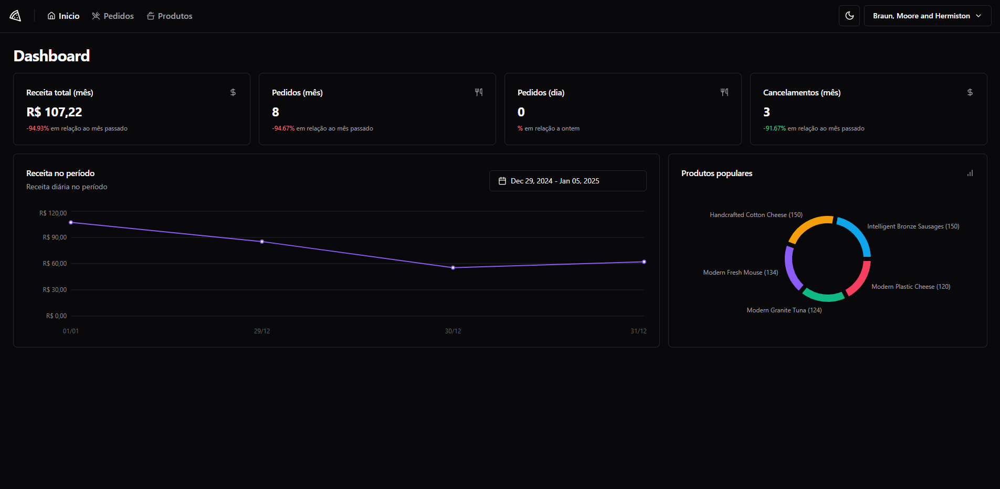
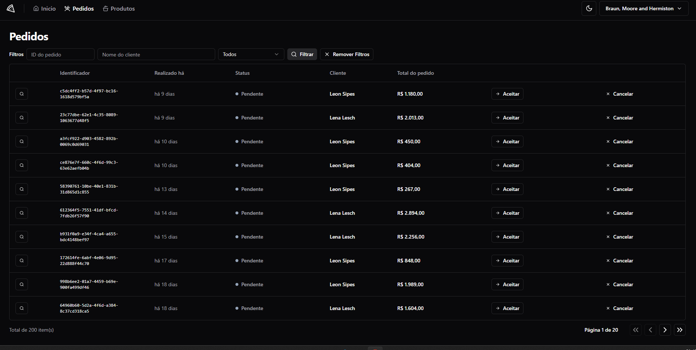

# Forkly

Forkly is a project designed as a learning and experimentation environment. It is a simple API built with [Fastify](https://www.fastify.io/) and [Drizzle ORM](https://orm.drizzle.team/) to test some ideas and architectural approaches. Additionally, it features a front-end built with React.

---

## Features

Forkly is designed to handle basic operations of a simple system:

- **Product Management**: Register new products in the system.
- **Restaurant Management**: Add and manage restaurants.
- **Clients**: Register clients to keep information organized.
- **Orders**: Manage orders linked to clients and restaurants.
- **Magic Link Authentication**: Secure and straightforward login using magic links.

---

## Key Technologies

### Back-end

- **Fastify**: Lightweight and fast web framework.
- **Drizzle ORM**: Modern ORM for strongly-typed and efficient data manipulation.
- **Request Context Architecture**: The system uses a context attached to HTTP requests, allowing easy access to application services throughout the request lifecycle.

### Front-end

- **React**: Library for building dynamic interfaces.
- **ShadCN UI**: Styled and accessible components.
- **React Hook Form**: Library for efficient form management.
- **React Router DOM**: Route management for single-page applications.

---

## Highlights

### Magic Link Authentication

- Magic Link Authentication eliminates the need for passwords by using links sent via email to validate user access.
- The system sets secure HTTP cookies after link validation, enhancing the application’s security and user experience.

### Architecture Test

- Implements a global context in HTTP requests, enabling centralized access to application services (like repositories and utilities).
- Simplifies code maintenance and scalability.

---

## Setup and Execution

### Requirements

- Node.js (version 16 or higher)
- Database compatible with Drizzle ORM (e.g., PostgreSQL)

### Installation

1. Clone the repository:

   ```bash
   git clone https://github.com/pedro5g/forkly.git
   cd forkly
   ```

2. Install dependencies:

   ```bash
   pnpm install
   ```

3. Configure environment variables in the `.env` file.

4. Run database migrations:

   ```bash
   pnpm migrate
   ```

5. Start the API:
   ```bash
   pnpm dev
   ```

### Front-end

1. Navigate to the front-end directory:
   ```bash
   cd frontend
   ```
2. Install dependencies:
   ```bash
   pnpm install
   ```
3. Start the development server:
   ```bash
   pnpm dev
   ```

---

## Images

## Dashboard

- 

##

- 

---

## License

This project is distributed under the MIT License. See the [LICENSE](./LICENSE) file for more details.
